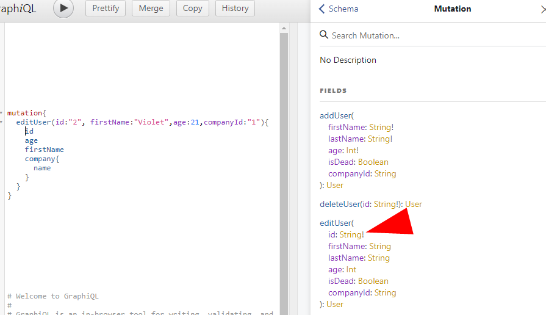

# GraphQL : Optimizing RESTful API calls
#### graphql-portfolio-project

## How to start
`npm run dev` for nodemon to track changes on server.js

`npm run json:server` for json-server (fake data server) to start (edit fake data at db.json) 

<sub><sub>Open both in different command prompts/terminals</sub></sub> 

Links :

[Tutorials Point](https://www.tutorialspoint.com/graphql/graphql_introduction.htm)

[Udemy - Stephen Grider](https://www.udemy.com/course/graphql-with-react-course/learn/lecture/6515072#overview)

- GraphQL is for optimizing the RESTful API calls
- Developed by Facebook
- It is open source server-side technology
- It is an execution engine
- It is a data query language

## What does it solves?

- RESTful APIs can be LONG, COMPLEX and SPECIFIC for a single problem.
- Why not catch all we need in a single request ?
- Traverse
- Retrieve
- Modify


### Examples :

Get id and first name of each student in Graph(i)QL :


```
{
    students 
    { 
        id,
        firstName
    }
}
```


In order this to work, 

- First we would write a StudentType
```
const StudentType = new GraphQLObjectType({
    name:'Student',
    fields:{
        id:{type : GraphQLString},
        firstName:{type : GraphQLString},
        // otherThings if neccessary
    }
})
```

- Then we would need to say that my StudentType is reachable from RootQuery
```
const RootQuery = new GraphQLObjectType({
    name:'RootQueryType',
    fields:{
        students:{
            type:StudentType,
            args:{id:{type:GraphQLString},
            resolve(parentValue,args){
                // return _.find(users,{id:args.id,isDead:args.isDead})
                return axios.get(`http://localhost:3000/student/${args.id}`)
                .then(resp => resp.data)
            }
        },
        //other fields
    }
    
```

- To have circular references make fields to be an **Arrow Function**

```
const StudentType = new GraphQLObjectType({
    name:'Student',
    fields:() => ({
        ...
    })
})

```
- To reference **custom types** define its type, args and resolve

```
const StudentType = new GraphQLObjectType({
    name:'student',
    fields:() => ({
        id:{type : GraphQLString},
        firstName:{type : GraphQLString},
        lastName:{type : GraphQLString},
        favoriteTeachers : {
            type : new GraphQLList(TeacherType),
            resolve(parentValue,args){
              return axios.get(`http://localhost:3000/students/${parentValue.id}/teachers`)
              .then(resp => resp.data)
        }
        // otherThings if neccessary
    })
})
```

- To get favorite teachers of a specific student we use :

```
{
    student(id:"0"){
        favoriteTeachers{
            firstName,
            lastName
        }
    }
}
```

- When we use queries we can name them. This feature will be useful when we use it on Front-end

```
query findCompany{
    company(id:"1"){
        id
        name
        desc
    }
}
```

- If we need multiple queries on the same field we can name them.

```
{
    apple: company(id:"0"){
        id
        name
        desc
    }
    google : company(id:"1"){
        id
        name
        desc
    }
}
```
- We need to make names unique, so we actually don't need both to be changed. One of them
may stay as company if we like. But we can't make both of their names as 'company'.
```
{
    apple: company(id:"0"){
        id
        name
        desc
    }
    company(id:"1"){
        id
        name
        desc
    }
}
```

- To ease the pain of declaring the same fields over and over again
We can use ***Query Fragments***. This will be important in Front-End.

```

{
    apple: company(id:"0"){
        ...companyDetails
    }
    company(id:"1"){
        ...companyDetails
    }
}


fragment companyDetails on Company{
    id
    name
    desc
}
```

- For adding a new user we need to ***MUTATE*** the datas. Hence we need a **Mutation** field in our RootQuery

```
const mutation = new GraphQLObjectType({           <---------------
    name:'Mutation',
    fields:{
        addUser:{
            type: UserType,
            args: {
                firstName:{type: new GraphQLNonNull(GraphQLString)},
                lastName:{type: new GraphQLNonNull(GraphQLString)},
                age:{type: new GraphQLNonNull(GraphQLInt)},
                isDead: {type: GraphQLBoolean},
                companyId: {type:GraphQLString}
            },
            resolve(parentValue, {firstName, lastName, age}){
                return axios.post('http://localhost:3000/users',{firstName, lastName, age})
                    .then(resp => resp.data);
            }
        }
    }
})

module.exports = new GraphQLSchema({
    query: RootQuery,
    mutation              <---------------
})
```

- After adding mutation we can see in the documentation of the GraphiQL as such


- Under the mutation title we can see (!) exclamation marks next to the REQUIRED fields


- To use the mutation on GraphiQL use this code

```
mutation{
    addUser(firstName: "New User", lastName:"Last Name", age:26){
        id,    <--------- Automatically adds this
        firstName,
        lastName,
        age
    }
}
```

- To delete a user write this code in the mutation field in the scheme.js as such :

```
deleteUser:{
    type: UserType,
    args: {
        id:{type: new GraphQLNonNull(GraphQLString)},
    },
    resolve(parentValue, {id}){
        return axios.delete(`http://localhost:3000/users/${id}`)
            .then(resp => resp.data);
    }
}
```
- Then call it on GraphiQL as such: 


Result:

```
{
    "data":{
        "deleteUser": {
            "id" : null
        }
    }
}
```

- To be able to edit users we would need to add an editUsers field under the mutations:

```
editUser:{
    type: UserType,
    args: {
        id:{type: new GraphQLNonNull(GraphQLString)},
        firstName:{type: GraphQLString},
        lastName:{type: GraphQLString},
        age:{type: GraphQLInt},
        isDead: {type: GraphQLBoolean},
        companyId: {type:GraphQLString}
    },
    resolve(parentValue, args){
        return axios.patch(`http://localhost:3000/users/${args.id}`,args)
            .then(resp => resp.data);
    }
}
```
- Let's call it as such :


## Section 5 - The GraphQL Ecosystem

- Now I want to use my GraphQL @ my Front-End application. There are JS client tools for this.

| Name            | Description                                                                            | Diffuculty  |
|-----------------|:---------------------------------------------------------------------------------------|:------------|
| `Lokka`         | As simple as possible. Basic queries, mutations. Some simple caching.                  | Easy        |
| `Apollo Client` | Produced by the same guse as Meteor JS. Good balance between features and complexity.  | Moderate    |
| `Relay`         | Amazingly performance for mobile. By far the most insanely complex.                    | Hard        |

We will use Relay on bigger projects and Apollo on rather smaller projects.

> [!TIP]
> Stephen prefers Relay on bigger and more complex projects.

- In this project we used Express GraphQL instead of Apollo Client/Server
we may see it under the package.json under the project.

| GraphQL Express                                                                                      | Apollo Server                                                                                                                                                                                                                                                                                                                                                                                                                                                                                                |
|------------------------------------------------------------------------------------------------------|:-------------------------------------------------------------------------------------------------------------------------------------------------------------------------------------------------------------------------------------------------------------------------------------------------------------------------------------------------------------------------------------------------------------------------------------------------------------------------------------------------------------|
| const CompanyType = new GraphQLObjectType({<br/>&nbsp;&nbsp;&nbsp;name:'Company', <br/>&nbsp;&nbsp;&nbsp;fields:()=>({...})<br/>}) | **Types File** <br/><br/> type User{<br/>&nbsp;&nbsp;&nbsp;id:String!, <br/>&nbsp;&nbsp;&nbsp;firstName:String, <br/>&nbsp;&nbsp;&nbsp;age:Int, <br/>&nbsp;&nbsp;&nbsp;company:Company<br/>}<br/><br/>type Company {<br/>&nbsp;&nbsp;&nbsp;id:String!, <br/>&nbsp;&nbsp;&nbsp;name:String, <br/>&nbsp;&nbsp;&nbsp;employees:[User]<br/>}<br/><br/> **Resolvers File**<br/><br/> const resolveFunctions = {<br/>&nbsp;&nbsp;Query:{<br/>&nbsp;&nbsp;&nbsp;return users,<br/>&nbsp;&nbsp;}<br/>}               |

> GraphQL Express is in one place Apollo Server is more divided.

# Now we will move on to the next project to view our learnings on Front-End side
## Please go to the Lyrical-GraphQL
[selenyel/Lyrical-GraphQL](https://github.com/selenyel/Lyrical-GraphQL)